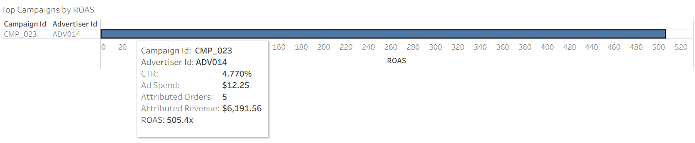
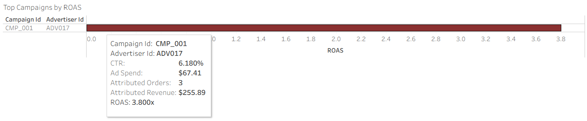
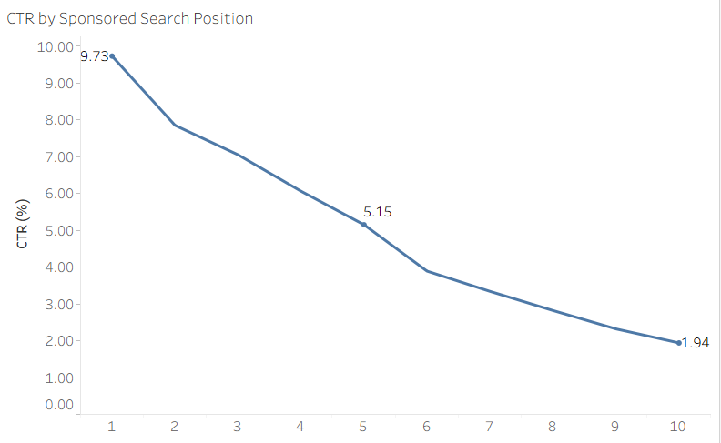
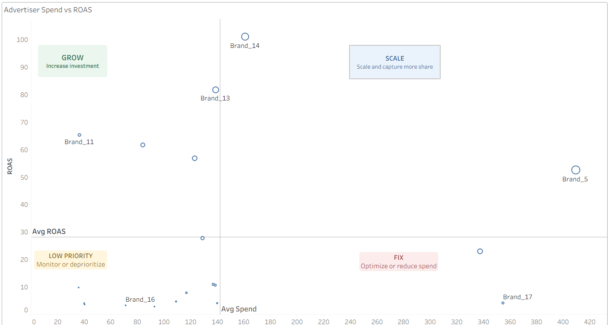

# Retail Media Performance & Optimization

An end-to-end retail media analytics project exploring how sponsored search placement, advertiser spend, and campaign performance influence customer engagement and Return on Ad Spend(ROAS).

## Project Overview
MarMart is a fictional ecommerce retailer that allows brands to advertise products within its search results. Advertisers pay MarMart when shoppers click sponsored products. MarMart wants to grow advertising revenue while ensuring advertisers receive good returns and shoppers continue receiving relevant search results.

## Business Problem & Questions
Retail media platforms need to balance advertiser performance with customer engagement. Higher sponsored placement may improve visiblity, but stronger enagagement does not always translate into better returns. Some questions the project explored includes:

1. Does higher sponsored-search placement improve Clich-through Rate(CTR)?
2. Does higher CTR translate into stronger ROAS?
3. Which advertisers should be scaled, monitored, or optimized?
4. Which campaigns are spending efficiently?

## Stakeholders
- Retail Media Product Manager
- Advertisers 
- Sales Team

## Key Metrics
| Metric              | Why It Matters                                                                                             | 
| :------------------ | :--------------------------------------------------------------------------------------------------------- |
| CTR                 | Measures engagement with sponsored placement                                                               |
| Ad Spend            | Tracks advertiser's cost                                                                                   |
| Attributed Revenue  | Revenue eligible to MarMart due to ad interactions                                                         |
| Attributed Orders   | Orders credited to ad clicks                                                                               |   
| ROAS                | Measures revenue generated per dollar spent                                                                |   
| Sponsored Position  | Indicates where an ad appeared in search: _1 for highest position and 10 for lowest position on a web page |

## Key Findings & Recommendations

### Campaigns
#### 1. Strong click-through rate (CTR) does not guarantee strong returns

CMP_001 achieved one of the highest CTRs at 6.18%, but produced a Return on Ad Spend (ROAS) of only 3.80x. By comparison, CMP_023 had a lower CTR of 4.77% but generated the highest ROAS at 505.43x.

**Recommendation**: CTR should not be used as the primary measure of campaign success. Product teams should evaluate clicks alongside conversion, attributed revenue, and ROAS

#### 2. Similar levels of engagement can produce very different business outcomes

Many campaigns have CTRs clustered around 4.6%, yet their ROAS varies dramatically. For example, CMP_023 achieved a 4.77% CTR and 505.43x ROAS, while CMP_048 achieved a 4.13% CTR and only 0.47x ROAS.

**Recommendation**: Click engagement explains only part of campaign performance. Revenue per conversion, bid cost, and conversion behavior need to be considered before making budget decisions.

### CTR & Ad Positioning
#### 3. Sponsored-search position strongly influences customer engagement

CTR declines consistently as sponsored products move lower in search results, falling from 9.73% at position 1 to 1.94% at position 10.

**Recommendation**: Higher sponsored-search placement substantially improves the likelihood of a click. However, campaign-level results show that higher engagement does not automatically produce higher ROAS, meaning placement decisions should balance visibility with downstream conversion and revenue outcomes.

### Advertisers

#### 4. Brand_5 performs strongly at scale

Brand_5 recorded the highest total ad spend at $409.39 and generated \$21,529.51 in attributed revenue from 18 attributed orders, while maintaining a ROAS of 52.59x.

**Recommendation**: Brand_5 demonstrates that strong advertising efficiency can be maintained at relatively high spend. Its campaign structure and product mix should be investigates for strategies that could potentially be replicated across other advertisers.

#### 5. Brand_14 is a strong candidate for scaling

Brand_14 generated \$16,270.01 in attributed revenue from $161.03 in ad spend, producing the highest advertiser-level ROAS in 101.04x.

**Recommendation**: Brand_14 appears to be both efficient and comercially valuable. A controlled increase in advertising investment could test whether its strong ROAS can be sustained at greater scale.

#### 6. Brand_17 represents an optimization opportunity

Brand_17 had the second-highest advertiser spend at $354.69 and generated 14 attributed orders, but its ROAS was only 4.16x.

**Recommendation**: Increasing spend should not be the immediate priority. The advertiser's campaigns should first be reviewed for inefficient bids, placement, targeting, or product selection.

## Interactive Dashboard
Explore the full Tableau dashboard: **[View Retail Media Performance & Optimization Dashboard](https://public.tableau.com/app/profile/mary.jonah/viz/RetailMediaPerformanceOptimizationDashboard/RetailMediaOverview)**
